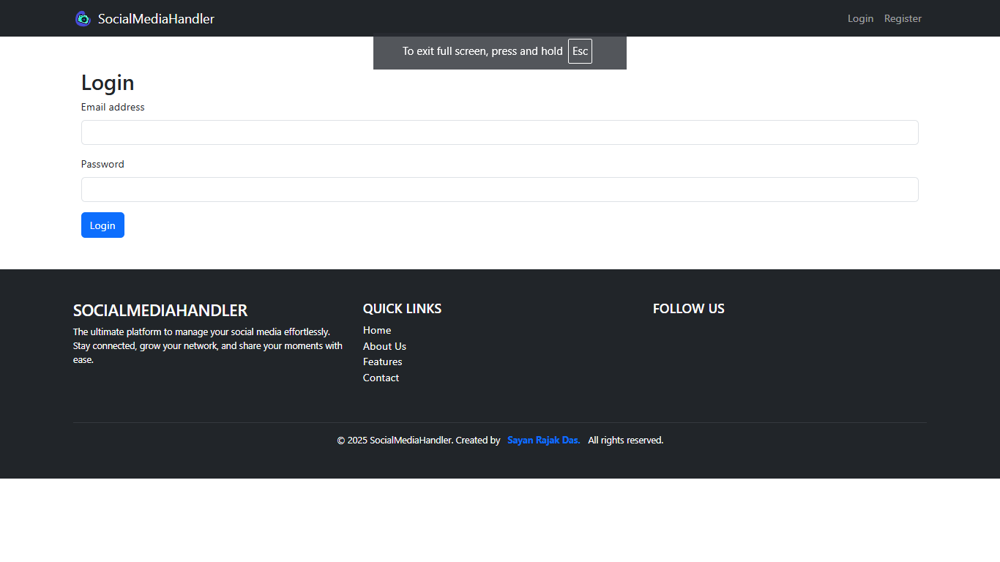
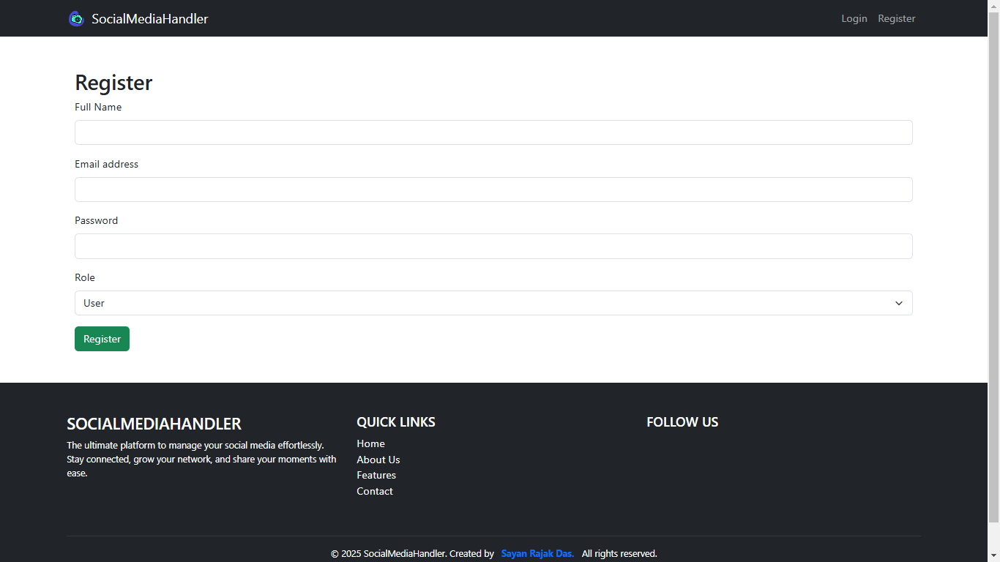
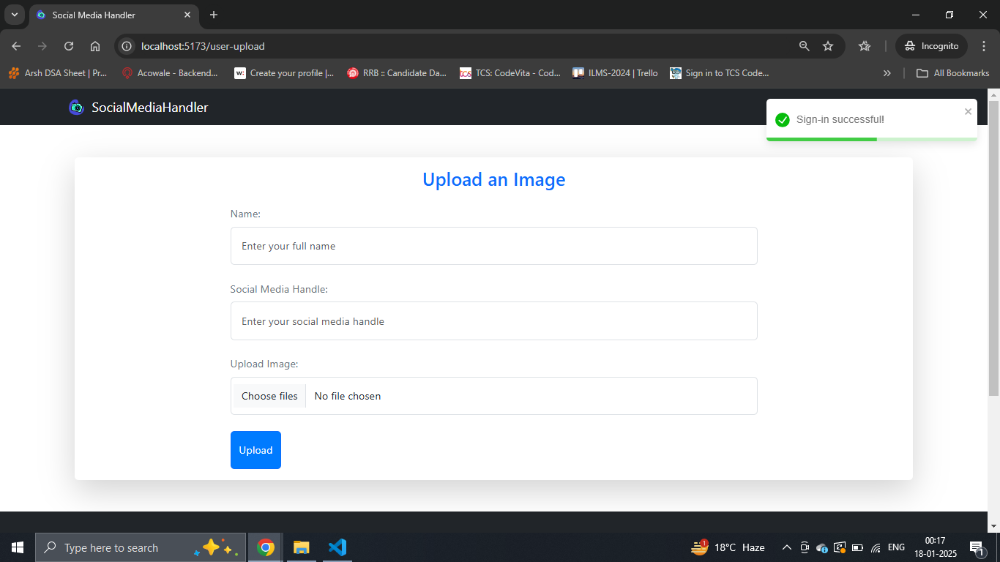
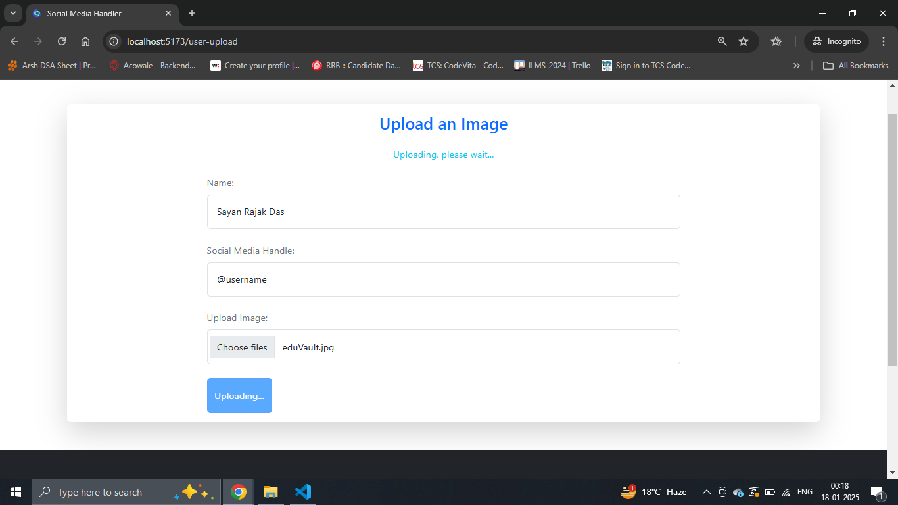
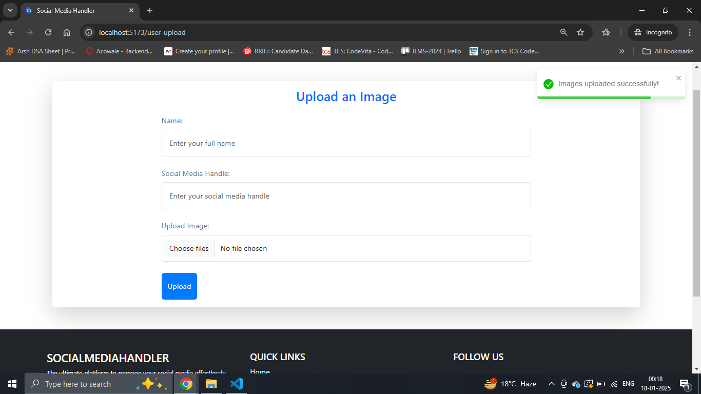
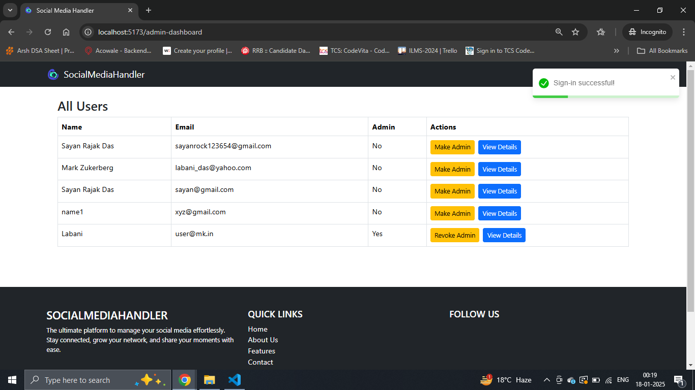
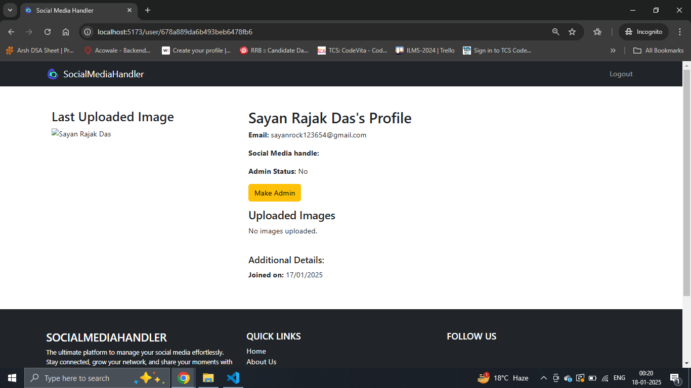
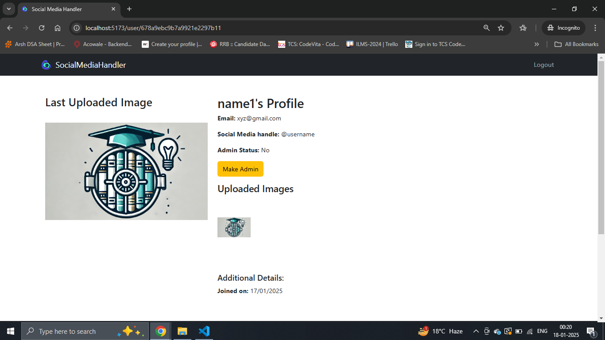

## Screenshots












---

# Social Media Handle Project

## Getting Started

### Clone the Repository

To clone the specific branch, run the following command:

```bash
git clone https://github.com/Sayan-Rajak-Das/Social-Media-Handler.git
```

### Backend Setup

1. Navigate to the backend directory:

```bash
cd <repo-name>
```

2. Install the necessary dependencies:

```bash
npm install
```

3. Run the backend server:

```bash
npm run dev
```

### Environment Variables for Backend

Create a `.env` file in the backend root directory with the following variables:

```env
MONGODB_URL='<your-mongodb-url>'
PORT=5001
CLOUDINARY_CLOUD_NAME="<your-cloudinary-cloud-name>"
CLOUDINARY_API_KEY="<your-cloudinary-api-key>"
CLOUDINARY_API_SECRET="<your-cloudinary-api-secret>"
```

### Frontend Setup

1. Navigate to the frontend directory:

```bash
cd <repo-name>
```

2. Install the necessary dependencies:

```bash
npm install
```

3. Run the frontend server:

```bash
npm run dev
```

### Environment Variables for Frontend

Create a `.env` file in the frontend root directory with the following variable:

```env
VITE_BASE_URL=<SERVER_URL>
```

---


